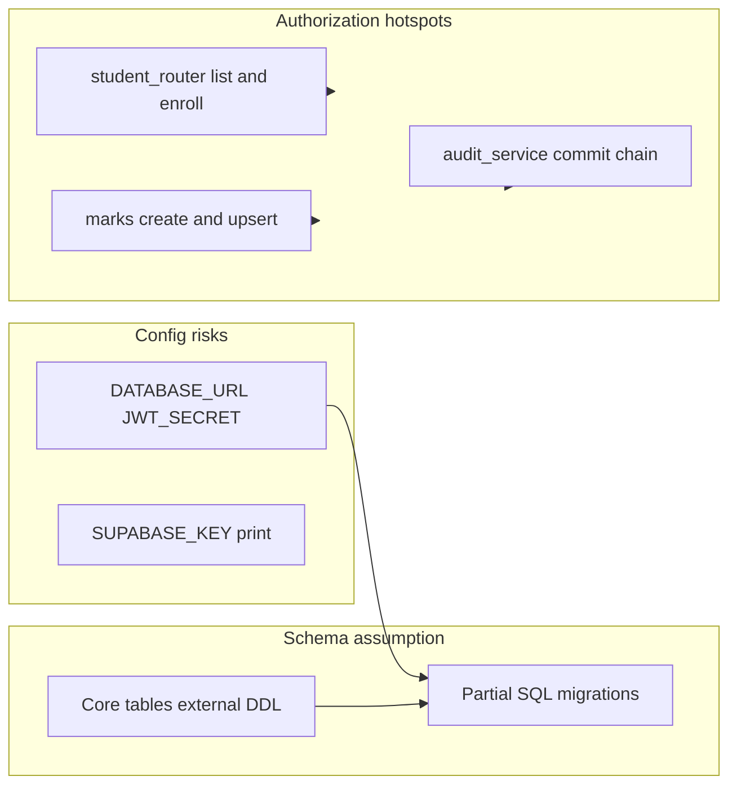

# UniMentee backend and database integration audit

## Executive summary

The backend **compiles cleanly** (`python -m compileall app` succeeds). There is **no Alembic** tree in the repo—only hand-written SQL under `[backend/migrations/](backend/migrations/)`. **Core domain tables** (`users`, `students`, `subject_offerings`, etc.) are **not created** by those scripts; they are assumed to exist (e.g. Supabase / external DDL). The highest-impact issues are **authorization gaps** on student and marks routes, **audit logging that never commits**, **config/runtime footguns** (`DATABASE_URL`, JWT default, secret printing), and a **documented but fragile** `curriculum_id` → `subjects.subject_id` shortcut used across services.

---

## Critical errors (must fix immediately)

| Issue                                                                                                 | Affected file(s)                                                                                                                                                       | Exact fix                                                                                                                                                                                                                                                                                                                                                                                                                                                                       |
| ----------------------------------------------------------------------------------------------------- | ---------------------------------------------------------------------------------------------------------------------------------------------------------------------- | ------------------------------------------------------------------------------------------------------------------------------------------------------------------------------------------------------------------------------------------------------------------------------------------------------------------------------------------------------------------------------------------------------------------------------------------------------------------------------- |
| **Audit inserts never persisted**                                                                     | `[backend/app/routers/portfolio_router.py](backend/app/routers/portfolio_router.py)`, `[backend/app/services/audit_service.py](backend/app/services/audit_service.py)` | `log_action` runs `INSERT` but does not `commit()`. The portfolio handler calls it **after** `db.commit()` for the main row, so the audit DML sits in an open transaction that is **rolled back on session close**. Either: commit after `log_action`, or document and enforce “callers must commit” and **actually commit** in the router (or move audit to a dependency that commits once per request).                                                                       |
| **Marks write APIs lack permission checks**                                                           | `[backend/app/routers/marks_router.py](backend/app/routers/marks_router.py)`, `[backend/app/services/marks_service.py](backend/app/services/marks_service.py)`         | `POST /marks/offerings/{offering_id}/assessments` and `PUT .../marks/{student_id}` only use `get_current_user`. `upsert_mark` has **no** `MARKS_ENTER` / role gate at entry (unlike `can_view_assessment_marks` for GET). Add `require_permission('MARKS_ENTER')` (or equivalent) on create/upsert, or enforce inside `marks_service` before mutating data.                                                                                                                     |
| **Student directory and enrollment mutation APIs are effectively “any authenticated user in tenant”** | `[backend/app/routers/student_router.py](backend/app/routers/student_router.py)`, `[backend/app/services/student_service.py](backend/app/services/student_service.py)` | `GET /students` and `GET /students/{student_id}` only require `get_current_user`—no `STUDENT_VIEW` / admin role. `get_student_enrollments` / `enroll` / `drop` use `get_student(..., university_id)` which **only proves the row exists in the university**, not that the **caller may act on that `student_id`**. Add checks: self-service for students on own `student_id`, or `require_permission` for staff; never rely on path `student_id` without actor–subject binding. |
| `**DATABASE_URL` unset → crash at import**                                                            | `[backend/app/config.py](backend/app/config.py)`, `[backend/app/database.py](backend/app/database.py)`                                                                 | `DATABASE_URL = os.getenv("DATABASE_URL")` then `create_engine(DATABASE_URL, ...)` will fail if missing. Fail fast with a clear error at startup, or lazy-init engine after config validation.                                                                                                                                                                                                                                                                                  |
| **Secrets printed on startup**                                                                        | `[backend/app/main.py](backend/app/main.py)`                                                                                                                           | `print("SUPABASE_KEY:", os.getenv("SUPABASE_KEY"))` leaks secrets to logs/stdout. Remove or gate behind debug flag.                                                                                                                                                                                                                                                                                                                                                             |
| **Fresh DB from repo migrations alone will fail**                                                     | `[backend/migrations/*.sql](backend/migrations/)`                                                                                                                      | `002_leave_requests.sql` references `students`, `subject_offerings`, `users`. `004_assessment_send_back.sql` alters `assessments`. **None** of the SQL files create those base tables. Document bootstrap order and supply a **single baseline schema** or migration runner order; otherwise automated “empty DB” deploys fail.                                                                                                                                                 |
| **Attendance auto-lock only runs for `university_id = 1`**                                            | `[backend/app/main.py](backend/app/main.py)`                                                                                                                           | `DEFAULT_UNIVERSITY_ID = 1` in `auto_lock_loop` means other tenants never auto-lock. Iterate all universities (from `university_settings` or distinct `university_id` from sessions) or read settings per university.                                                                                                                                                                                                                                                           |

---

## Medium-risk issues

| Issue                                                                                      | File(s)                                                                                                                                                                                                                                                                                 | Recommendation                                                                                                                                                                                                                          |
| ------------------------------------------------------------------------------------------ | --------------------------------------------------------------------------------------------------------------------------------------------------------------------------------------------------------------------------------------------------------------------------------------- | --------------------------------------------------------------------------------------------------------------------------------------------------------------------------------------------------------------------------------------- |
| `**curriculum_id` treated as `Subject.subject_id**` (shortcut until real curriculum graph) | `[backend/app/routers/faculty_router.py](backend/app/routers/faculty_router.py)` (documented), `[backend/app/services/attendance_summary_service.py](backend/app/services/attendance_summary_service.py)`, `[backend/app/routers/leave_router.py](backend/app/routers/leave_router.py)` | If production DDL uses `curriculum_id` as a foreign key to a **curriculum** table (not `subjects`), subject names and joins will be wrong. Add a migration + model for the real relationship or rename column when schema is finalized. |
| **Duplicate migration prefix `003_*.sql`**                                                 | `[backend/migrations/003_announcements.sql](backend/migrations/003_announcements.sql)`, `[003_audit_logs.sql](backend/migrations/003_audit_logs.sql)`, `[003_university_logo_url.sql](backend/migrations/003_university_logo.sql)`                                                      | Rename to a single linear sequence (e.g. `005_...`) or use a runner manifest so order is unambiguous for operators.                                                                                                                     |
| **JWT default secret**                                                                     | `[backend/app/config.py](backend/app/config.py)`                                                                                                                                                                                                                                        | `JWT_SECRET` defaults to `"supersecret"`. Require explicit env in production.                                                                                                                                                           |
| **ORM models lack `relationship()` / `back_populates`**                                    | Most of `[backend/app/models/](backend/app/models/)*`                                                                                                                                                                                                                                   | Not fatal if code uses explicit `query().join()`, but increases risk of inconsistent loads and hides FK mistakes. Add relationships incrementally where used.                                                                           |
| **Inconsistent naming / minor model hygiene**                                              | `[backend/app/models/academic.py](backend/app/models/academic.py)` (`department` lowercase class), `[backend/app/models/marks.py](backend/app/models/marks.py)` (unused pydantic/date imports)                                                                                          | Rename for consistency; strip dead imports to reduce noise.                                                                                                                                                                             |
| `**Program.department_id` no `ForeignKey` in model**                                       | `[backend/app/models/academic.py](backend/app/models/academic.py)`                                                                                                                                                                                                                      | Align with DB: add `ForeignKey('departments.department_id')` if column exists in DB.                                                                                                                                                    |
| `**mentor_repository` debug prints**                                                       | `[backend/app/repositories/mentor_repository.py](backend/app/repositories/mentor_repository.py)`                                                                                                                                                                                        | Remove `print` or use structured logging at DEBUG.                                                                                                                                                                                      |
| `**abcd.py` in backend root**                                                              | `[backend/abcd.py](backend/abcd.py)`                                                                                                                                                                                                                                                    | One-off password hash script; remove from repo or move to documented tooling (security / clutter).                                                                                                                                      |
| `**compute_sgpa_for_offering` commits inside loop**                                        | `[backend/app/services/marks_service.py](backend/app/services/marks_service.py)`                                                                                                                                                                                                        | Prefer one transaction for all enrollments; avoids partial SGPA updates on mid-loop failure.                                                                                                                                            |
| `**.env` not in repo**                                                                     | (none found under `backend/`)                                                                                                                                                                                                                                                           | Expected; document required vars: `DATABASE_URL`, `JWT_SECRET`, any storage keys. Operators must supply locally.                                                                                                                        |
| **PostgreSQL-specific features without guard**                                             | `[backend/app/repositories/attendance_repository.py](backend/app/repositories/attendance_repository.py)` (`insert ... on_conflict_do_update`), `[backend/app/services/marks_service.py](backend/app/services/marks_service.py)`                                                         | Document “Postgres required” or abstract for SQLite for local dev.                                                                                                                                                                      |
| `**sslmode=require` always on**                                                            | `[backend/app/database.py](backend/app/database.py)`                                                                                                                                                                                                                                    | Local Postgres without SSL may fail; make SSL mode configurable via env.                                                                                                                                                                |

---

## Safe / looks good (confirmed patterns)

- **Mentor scope**: `[backend/app/routers/mentor_router.py](backend/app/routers/mentor_router.py)` checks `assignment.mentor_user_id == user.user_id` for assignment-scoped routes; `_verify_mentor_assignment` used where needed.
- **Faculty analytics**: `[backend/app/routers/faculty_router.py](backend/app/routers/faculty_router.py)` enforces `course_lead_id == user.user_id` for `offering_id` analytics.
- **Marks read path**: `[backend/app/services/marks_service.py](backend/app/services/marks_service.py)` `can_view_assessment_marks` gates `GET /marks/assessments/{id}/marks`.
- **Announcements publish**: `[backend/app/routers/announcements_router.py](backend/app/routers/announcements_router.py)` uses `require_permission('ANNOUNCEMENT_PUBLISH')` for `POST`; list filters by university and student targeting where applicable.
- **Admin router**: Heavy use of `require_permission` / `require_any_permission` (`[backend/app/routers/admin_router.py](backend/app/routers/admin_router.py)`).
- **Auth token payload**: `[backend/app/services/auth_service.py](backend/app/services/auth_service.py)` includes `sub` and `university_id` for tenant scoping in `[backend/app/core/rbac.py](backend/app/core/rbac.py)`.
- **Leave flows**: Student-scoped helpers in `[backend/app/routers/leave_router.py](backend/app/routers/leave_router.py)`; cancel checks ownership.

---

## Suggested smoke tests (exact endpoints)

Run against a **seeded** DB (not empty migrations-only). Order: health → auth → tenant-scoped reads → privileged writes.

1. `GET /health` — process up.
2. `POST /auth/login` — obtain JWT (body per `[backend/app/schemas/auth.py](backend/app/schemas/auth.py)`).
3. `GET /auth/me` — verify `permissions`, `roles`, `university_id`.
4. `GET /students` — **document current behavior** (any authenticated user): confirm whether this matches product policy.
5. `GET /students/me` — student profile path.
6. `GET /announcements` — university + targeting.
7. `GET /mentor/assignments` — mentor user; verify 403/404 boundaries with wrong IDs.
8. `GET /faculty/subjects` — course lead user; empty vs populated.
9. `GET /marks/offerings/{offering_id}/assessments` then `GET /marks/assessments/{assessment_id}/marks?include_students=true` — verify view gate.
10. `PUT /marks/assessments/{assessment_id}/marks/{student_id}` — **after** fixing auth, verify 403 for non-marker.
11. `POST /portfolio/items` then confirm `**audit_logs` row exists** in DB (after audit fix).
12. `GET /attendance/offerings/{offering_id}/sessions` — list sessions for offering.

---

## Notes on duplicate paths / tooling

- Git status shows both `backend/app/...` and `backend\app\...` style paths on Windows; that is a **version-control path normalization** artifact, not separate Python modules.
- `[backend/app/routers/test_secure.py](backend/app/routers/test_secure.py)` exists but is **not** included in `[backend/app/main.py](backend/app/main.py)` (intentional for production).

